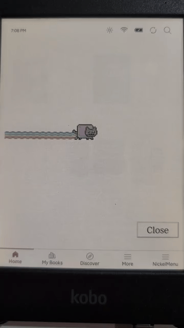

# Nickel Menu Example Plugin
Template with an example Qt GUI plugin for Kobo eReaders launched with [NickelMenu](https://pgaskin.net/NickelMenu/)

## Build status


## Demo



## Building

Check out the [NickelMenu fork with Qt GUI plugin support](https://github.com/flibbertigibbet/NickelMenu) submodule in this repo:

```bash
git submodule update --init --recursive
```

To generate and build an example plugin using the [NickelTC](https://github.com/pgaskin/NickelTC) Docker image:

```bash
docker run -u $(id -u):$(id -g) --volume="$PWD:$PWD" --entrypoint=make --workdir="$PWD" --env=HOME --rm -it ghcr.io/pgaskin/nickeltc:1 NAME=MySpecialPlugin
```

This will generate an example plugin named `MySpecialPlugin` in the `src` directory, if it does not already exist.
Then, it will build it, putting a `KoboRoot.tgz` artifact in the top-level project directory containing libraries for NickelMenu and the plugin, as well as a menu configration that will add `MySpecialPlugin` to the main menu.


Multiple plugins may be built from source code nested in the top-level `src` directory into a single `KoboRoot.tgz` artifact by building them in series; the last artifact built will contain the current as well as all the previously built plugins, if they have not first been individually removed with `clean`. To remove all plugin libraries and their menu config files from the build, use `make clean_all_plugins`:

```bash
docker run -u $(id -u):$(id -g) --volume="$PWD:$PWD" --entrypoint=make --workdir="$PWD" --env=HOME --rm -it ghcr.io/pgaskin/nickeltc:1 clean_all_plugins
```

## Credits

Based on [NickelPlugin](https://github.com/shermp/NickelPlugin).
